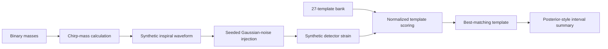

# gw-inference-engine

A lightweight gravitational-wave inference teaching pipeline. It synthesizes compact-binary chirps, injects them into deterministic Gaussian detector noise, calculates matched-filter-like SNR, and estimates a posterior-like mass range from a small template bank.

## Why this project exists

Gravitational-wave inference connects theoretical source models, noisy detector measurements, signal searches, and Bayesian interpretation. This repository exposes that sequence in a compact form that runs without a large scientific software stack, making the data flow and assumptions easy to inspect.

It is a foundation for later work with GWOSC strain, LALSuite waveforms, PSD-weighted matched filtering, numerical-relativity surrogates, and full parameter estimation.

## Architecture



## Quick start

```bash
python -m venv .venv
source .venv/bin/activate
python -m pip install -e ".[dev]"
python -m gw_inference_engine.pipeline --mass-1 36 --mass-2 29 --seed 2
pytest
```

On Windows PowerShell, activate the environment with `.venv\Scripts\Activate.ps1`.

### Command-line options

| Option | Default | Purpose |
| --- | ---: | --- |
| `--mass-1` | `36` | Primary component mass in solar-mass units |
| `--mass-2` | `29` | Secondary component mass in solar-mass units |
| `--seed` | `0` | Seed controlling the synthetic detector noise |

Example output from the verified run:

```text
{'injected_chirp_mass': 28.1, 'snr': 1.41, 'posterior': PosteriorSummary(chirp_mass=8, lower_90=0.89, upper_90=15.11)}
```

The interval shown above belongs to the teaching approximation. It should not be compared with a published LIGO/Virgo/KAGRA posterior.

## MVP snapshot

| Metric | Verified demo result |
| --- | ---: |
| Synthetic observation duration | 2.0 s |
| Sampling rate | 256 Hz (512 samples) |
| Injected chirp mass | 28.10 solar masses |
| Template bank | 27 equal-mass templates |
| Demonstration matched-filter SNR | 1.41 |

These values come from `python -m gw_inference_engine.pipeline --mass-1 36 --mass-2 29 --seed 2`. They are baseline diagnostics for a deterministic teaching model, not a calibrated astrophysical recovery or a claim about real detector data.

## What is implemented today

| Stage | MVP implementation | Next research integration |
| --- | --- | --- |
| Waveform | analytic chirp-mass helper and compact inspiral proxy | LALSuite, EOB, IMRPhenom, and NR surrogate |
| Detector | seeded Gaussian-noise injection | GWOSC strain, PSD estimation, and antenna patterns |
| Search | normalized time-domain template score | FFT matched filtering and chi-squared vetoes |
| Inference | SNR-shaped posterior summary | dynesty / NumPyro 15-parameter posterior |

The source tree preserves the production pipeline boundaries while keeping the first executable example dependency-light and fully deterministic.

## Signal and search model

The demo generates a two-second, 256 Hz chirp-like waveform from the component masses, then adds seeded Gaussian noise with a standard deviation of `0.2`. The template bank contains equal-mass systems from `8` through `60` solar-mass units in steps of `2`.

The current search statistic is a normalized time-domain dot product:

```text
score = Σ(data × template) / √Σ(template²)
```

The reported `snr` is therefore a convenient deterministic score, not the PSD-weighted network SNR used in production gravitational-wave searches. The posterior width scales inversely with that score and exists to exercise the inference boundary of the pipeline.

## Module guide

| Module | Responsibility |
| --- | --- |
| `waveforms.py` | Chirp-mass calculation and synthetic inspiral generation |
| `detector.py` | Reproducible Gaussian detector-noise injection |
| `search.py` | Template scoring and best-template selection |
| `inference.py` | Posterior summary data model and interval calculation |
| `pipeline.py` | Template-bank construction, orchestration, and CLI |
| `tests/test_pipeline.py` | Determinism, signal-score, and interval-order checks |

## Validation and reproducibility

```bash
python -m gw_inference_engine.pipeline --mass-1 36 --mass-2 29 --seed 2
python -m compileall -q src
pytest
```

`tests/test_pipeline.py` verifies deterministic output, a nonzero demonstration SNR, and an internally ordered posterior interval. GitHub Actions installs the optional development dependency set and executes the test suite on every push and pull request.

## Current limitations

- The waveform is a compact chirp proxy rather than a calibrated PN, EOB, phenomenological, or NR model.
- Noise is white and Gaussian; no detector PSD or nonstationary glitch model is used.
- Templates are equal-mass and scored in the time domain without whitening or FFT acceleration.
- The search statistic is not a production matched-filter SNR.
- The interval summary is not a sampled Bayesian posterior.
- Real GWOSC downloads, detector networks, sky localization, and post-merger physics are not yet connected.

## Roadmap

1. Add GWOSC event download, conditioning, and PSD estimation.
2. Validate FFT-based matched filtering against PyCBC reference results.
3. Introduce LALSuite and IMRPhenom waveform adapters.
4. Implement dynesty or NumPyro parameter estimation with explicit priors.
5. Add detector-network coincidence, sky localization, and diagnostic plots.

## Repository layout

- `src/gw_inference_engine/`: waveform, detector, search, inference, and pipeline code
- `training/`: reserved surrogate-training workflows and checkpoints
- `catalogs/`: reserved GWOSC metadata, strain cache, and injection sets
- `benchmarks/`: reserved accuracy and recovery studies
- `notebooks/`: reserved event-analysis tutorials
- `tests/`: deterministic regression tests

This scaffold separates waveform, detector, search, inference, and post-merger packages so real GWOSC, LALSuite, PyCBC, dynesty, NumPyro, SXS, and ligo.skymap integrations can be added without changing the public workflow. The present signal model is educational and must not be used for scientific claims.
